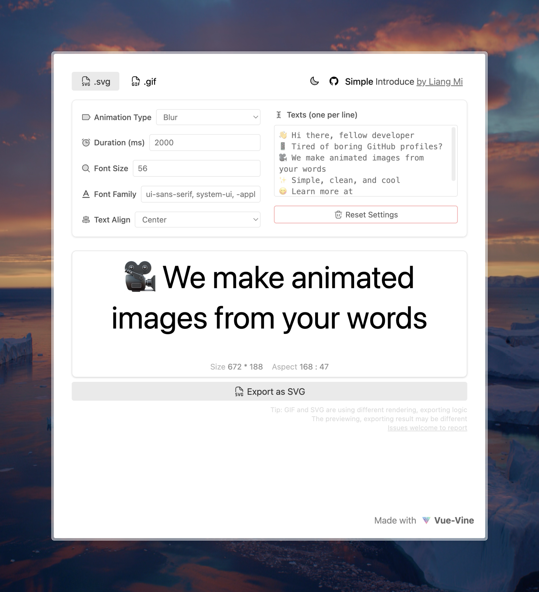

# Simple Introduce 🎬

A modern web app for creating beautiful animated text introductions and exporting them as SVGs. Perfect for GitHub profiles, READMEs, and social media.

<picture>
  <!-- Dark mode image -->
  <source srcset="./docs/dark-screenshot.png" media="(prefers-color-scheme: dark)">
  <!-- Light mode image -->
  <source srcset="./docs/light-screenshot.png" media="(prefers-color-scheme: light)">
  <!-- Fallback -->
  
</picture>


## ✨ Features

- **Animated Text Creation**: Create smooth text animations with fade or blur effects
- **Real-time Preview**: See your animation live as you type
- **SVG Export**: Export your animations as lightweight SVG files
- **Customizable Settings**: Adjust duration, font size, text alignment, and appearance
- **Dark/Light Mode**: Toggle between themes for different export options
- **Responsive Design**: Works perfectly on desktop and mobile devices

## 🚀 Development Guide

### Prerequisites

- Node.js 18+
- [ni](https://github.com/antfu-collective/ni) (recommended) or pnpm

### Installation

1. Clone the repository:
```bash
git clone https://github.com/liangmiQwQ/simple-introduce.git
cd simple-introduce
```

2. Install dependencies:
```bash
pnpm install
```

3. Start the development server:
```bash
pnpm dev
```

4. Open your browser and navigate to `http://localhost:5173`

### Building for Production

```bash
pnpm build
```

The built files will be in the `dist` directory.

## 📖 Usage

1. **Enter Your Text**: Type your introduction text, one line per animation frame
2. **Customize Settings**: Adjust animation type, duration, font size, and alignment
3. **Preview**: Watch your animation in real-time
4. **Export**: Click "Export as SVG"
5. **Download**: Copy the SVG code or download the SVG file

### Export Options

- **Appearance**: Choose between automatic, light, or dark themes
- **Custom Sizing**: Automatic responsive sizing based on content
- **Lightweight Output**: SVG animation stays editable and easy to embed

## 🎯 Current Status

✅ **Core Features Complete**:
- Text animation creation
- Real-time preview
- SVG export functionality
- Dark/light mode support
- Responsive design
- Customizable settings

🔜 **Planned Enhancements**:
- Markdown support
- More animation effects

## 🤝 Contributing

Contributions are welcome! We'd love your contributions! Before submitting your contribution, please take a moment to read through the following guidelines:

- For any new feature additions, we recommend submitting an issue for discussion and confirmation first.
- Pull requests are encouraged and will be reviewed promptly.

## 🙏 Credits

- Built with [Vue](https://vuejs.org/)
- Inspired by modern web animation tools

Thanks!

## 📄 License

This project is licensed under the MIT License - see the [LICENSE](LICENSE) file for details.
